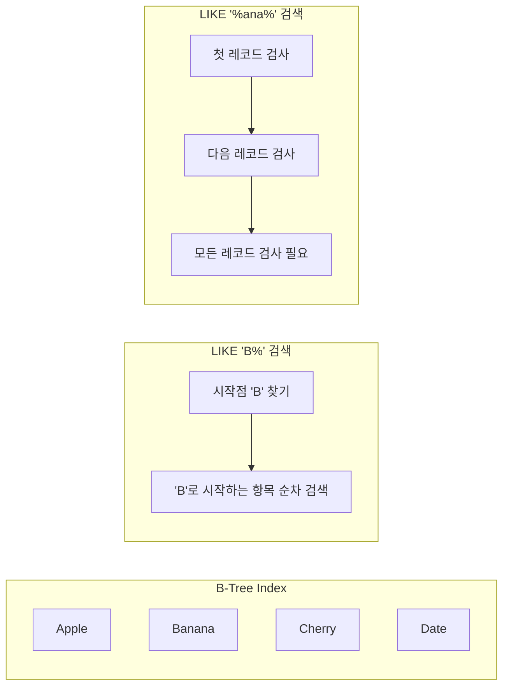

# DB 성능개선: Full Text Search Deep Dive

## 개요

데이터베이스에서 텍스트 검색을 구현할 때 가장 일반적으로 사용되는 LIKE 연산자는 큰 성능 이슈를 가져올 수 있습니다.
<br>특히 `%keyword%` 패턴을 사용할 경우, 인덱스를 활용할 수 없어 전체 테이블 스캔이
발생합니다.
<br>이러한 문제를 해결하기 위한 Full Text Search에 대해 자세히 알아보겠습니다.

## 퀴즈 검색 개선

### 기존 방식

- 게임을 시작하기 전에 풀 퀴즈셋을 검색하고 선택<br>
  
- 백엔드에서는 아래와 같은 쿼리 실행후 응답

```sql
SELECT `quizSet`.`id` AS `quizSet_id`
FROM `quiz_set` `quizSet`
WHERE (`quizSet`.`title` LIKE '%상식%' AND `quizSet`.`deletedAt` IS NULL)
  AND (`quizSet`.`deletedAt` IS NULL);
```

기존방식의 문제점 :

1. 인덱스 활용 불가
2. 전체 테이블 스캔 필요
3. 지금은 데이터가 적어 문제가 없지만, 데이터가 많아지면 성능 저하 발생 예상
4. 성능이슈가 생길 수 있는 가능성을 미리 차단하고자 함

## 개선전 성능측정

1. 임의의 데이터 10만개 삽입

```sql
INSERT INTO quiz_set (title, createdAt, updatedAt, deletedAt, user_id, category)
WITH RECURSIVE cte(n) AS (SELECT 1
                          UNION ALL
                          SELECT n + 1
                          FROM cte
                          WHERE n < 100000)
SELECT CASE
           WHEN n % 5 = 0 THEN CONCAT('일반상식 퀴즈 #', LPAD(n, 4, '0'))
           WHEN n % 5 = 1 THEN CONCAT('역사 퀴즈 #', LPAD(n, 4, '0'))
           WHEN n % 5 = 2 THEN CONCAT('과학 퀴즈 #', LPAD(n, 4, '0'))
           WHEN n % 5 = 3 THEN CONCAT('문학 퀴즈 #', LPAD(n, 4, '0'))
           ELSE CONCAT('시사 퀴즈 #', LPAD(n, 4, '0'))
           END AS title, TIMESTAMP (DATE_SUB(NOW(), INTERVAL FLOOR(RAND() * 365) DAY) + INTERVAL FLOOR(RAND() * 86400) SECOND), TIMESTAMP (DATE_SUB(NOW(), INTERVAL FLOOR(RAND() * 365) DAY) + INTERVAL FLOOR(RAND() * 86400) SECOND), CASE WHEN RAND() < 0.1 THEN CURRENT_TIMESTAMP ELSE NULL
END
,
    FLOOR(1 + RAND() * 100),
    CASE 
        WHEN n % 5 = 0 THEN 'GENERAL'
        WHEN n % 5 = 1 THEN 'HISTORY'
        WHEN n % 5 = 2 THEN 'SCIENCE'
        WHEN n % 5 = 3 THEN 'LITERATURE'
        ELSE 'CURRENT'
END
FROM cte;
```

2. api 호출
   
   
   
   
   평균 500~600ms 소요 && Full Table Scan

## 개선방법

### 퀴즈 검색 기능

- 실시간 퀴즈 서비스에서 풀 퀴즈를 검색하는것은 필수적인 기능
- 프로젝트 개발 기간이 제한적
- Elasticsearch 등의 검색 엔진을 도입하기에는 시간적, 학습적 제약이 있음
- 이미 도입된 기술스택인 MySQL의 Full Text Search을 활용하여 검색 성능을 향상시키는 방법을 선택

### Like 연산자가 index 스캔이 안되는 이유

'%text%'와 같은 패턴에서 검색할 문자열이 어디에 위치할지 모르기 때문에,
데이터베이스 엔진은 모든 레코드를 확인해야함

예시)



1. `LIKE 'B%'` 경우:
    - 인덱스에서 'B'로 시작하는 위치를 찾음
    - 그 위치부터 순차적으로 검색
    - 효율적인 검색 가능

2. `LIKE '%ana%'` 경우:
    - 'ana'가 단어의 어느 위치에 있을지 모름
    - 정렬된 인덱스를 활용할 수 없음
    - 모든 레코드를 확인해야 함 (Full Table Scan)

예시:

- "B로 시작하는 책" → 'B' 섹션으로 바로 이동 가능
- "중간에 'art'가 들어가는 책" → 모든 책을 하나씩 확인해야 함
- **우리가 원하는것은 중간에 '과학' 이 들어가는 퀴즈를 찾는것**

## Full Text Search 알아보기

### Search Types

1. **Natural Language Search**

```sql
SELECT *
FROM table
WHERE MATCH (column) AGAINST('search terms');
```

- 자연어 모드는 기본 검색 모드
- 관련성(relevancy) 점수 반환
- 불용어(stopwords) 무시
- 3글자 미만 단어 무시 (기본설정)
- 50% 이상 행에 나타나는 단어 무시

2. **Boolean Mode**

```sql
SELECT *
FROM table
WHERE MATCH (column) AGAINST('search terms' IN BOOLEAN MODE);
```

특수 연산자 지원:

- `+word`: 필수 포함
- `-word`: 제외
- `>word`: 관련성 점수 증가
- `<word`: 관련성 점수 감소
- `(*)`: 와일드카드
- `"phrase"`: 정확한 구문 검색

### Parsers

1. **기본 파서**

```sql
ALTER TABLE table_name
    ADD FULLTEXT INDEX index_name(column);
```

```sql
유동훈은
오늘도 코딩을 한다 -> 
유동훈은 / 오늘도 / 코딩을 / 한다
```

- 단어 단위로 분리
- 기본 불용어 처리
- 최소/최대 단어 길이 적용
- **단점 : '동훈'으로 검색시 검색불가능!!**

2. **ngram 파서**

```sql
ALTER TABLE table_name
    ADD FULLTEXT INDEX index_name(column) WITH PARSER ngram;
```

```sql
유동훈은
오늘도 코딩을 한다 -> 
유동/ 동훈 / 훈은 / 은오 / 오늘 / 도코 / 코딩 / 딩을 / 을한 / 한다
```

- 문자 단위로 분리
- 한중일 등 아시아 언어에 적합

설정 선택 :

- 관련성 점수가 필요없으므로 **Boolean Mode** 사용
- 한글 서비스 이므로 **ngram** 파서 사용

## 구현

### 1. MySQL Full Text Search 설정

```
# 최소 토큰 길이설정(한글은 2단어부터 중요한 의미)
# etc/mysqld.cnf 수정
innodb_ft_min_token_size = 2 
```


### 2. TypeORM Entity 설정

- db에서 설정하기보다는 코드단위에서 개발자가 파악하기 쉽도록 typescript 코드에서 설정

```typescript
@Entity('quiz_set')
export class QuizModel extends BaseModel {
    @Column('text')
    @Index({
        fulltext: true,
        parser: 'ngram'
    })
    title: string;
```

### 3. 검색 서비스 구현

```typescript
@Injectable()
export class QuizSetReadService {
    private async findSearchTargetIdsFS(search: string): Promise<number[]> {
        const searchQuery = `+"${search.split(' ').join('" +"')}"`;

        const quizSetIds = await this.quizSetRepository
            .createQueryBuilder('quizSet')
            .select('quizSet.id')
            .where('MATCH(quizSet.title) AGAINST (:search IN BOOLEAN MODE)', {
                search: searchQuery
            })
            .andWhere('quizSet.deletedAt IS NULL')
            .getMany();
    ...
    }
```

## 믿었던 Full Text Search의 배신

- like문의 결과 : 666ms
  
  
- Full Text Search 결과 : 723ms
- 항상 Full Text Search 의 성능이 좋은것은 아님<br>
  
  

- 추정원인
    - test data가 과학퀴즈 #random int와 같은 매우 간단한 형식으로 되어있음
    - Full Text Search는 token화 작업후 index를 탐색
    - like문은 token화 작업이 없음
    - token화 작업 오버헤드가 더 컸던 것으로 추정
- 해결
    - Full Text Search의 성능을 높이기 위해 실사용에 가까운 더 복잡한 데이터를 생성하여 테스트

```sql
SET SESSION cte_max_recursion_depth = 1000000;


INSERT INTO quiz_set (title, createdAt, updatedAt, deletedAt, user_id, category)
WITH RECURSIVE
    cte(n) AS (SELECT 1
               UNION ALL
               SELECT n + 1
               FROM cte
               WHERE n < 100000),
    title_components
        AS (SELECT '인공지능과 빅데이터로 알아보는,4차 산업혁명 시대의 핵심,메타버스와 웹3.0이 만드는,양자컴퓨팅이 여는 새로운,블록체인과 암호화폐가 바꾸는,딥러닝과 강화학습으로 이해하는,데이터 사이언스로 분석하는,클라우드 컴퓨팅으로 확장하는,사물인터넷과 연결되는,분산시스템으로 구현하는' as modern_prefix,
                   '기계학습과 신경망의 기초,빅데이터 분석과 시각화,양자역학과 상대성이론,유전자 알고리즘과 진화연산,뇌과학과 인지공학의 원리,네트워크 이론과 그래프 분석,확률통계와 데이터마이닝,알고리즘과 자료구조의 응용,시스템 설계와 아키텍처,보안과 암호화의 기본'               as core_topics,
                   '시대를 선도하는 기술 혁신:,미래를 준비하는 핵심 역량:,산업 현장의 실전 응용:,차세대 기술의 패러다임:,혁신적 사고의 프레임워크:,디지털 전환의 핵심 동력:,지속 가능한 발전 전략:,창의적 문제 해결 방법론:,스마트 시대의 필수 지식:,글로벌 트렌드의 중심에서:'   as prefix_phrases)
SELECT CASE
           WHEN n % 5 = 0 THEN CONCAT(
                   SUBSTRING_INDEX(SUBSTRING_INDEX(modern_prefix, ',', 1 + FLOOR(RAND() * 10)), ',', -1), ' ',
                   '일반상식의 새로운 관점 | ',
                   SUBSTRING_INDEX(SUBSTRING_INDEX(core_topics, ',', 1 + FLOOR(RAND() * 10)), ',', -1),
                   ' | 기초부터 고급까지 파트 ', n
                               )
           WHEN n % 5 = 1 THEN CONCAT(
                   SUBSTRING_INDEX(SUBSTRING_INDEX(prefix_phrases, ',', 1 + FLOOR(RAND() * 10)), ',', -1), ' ',
                   '역사 속 혁신과 도전 | ',
                   SUBSTRING_INDEX(SUBSTRING_INDEX(core_topics, ',', 1 + FLOOR(RAND() * 10)), ',', -1),
                   ' | 시대별 변천사 제', n, '권'
                               )
           WHEN n % 5 = 2 THEN CONCAT(
                   SUBSTRING_INDEX(SUBSTRING_INDEX(modern_prefix, ',', 1 + FLOOR(RAND() * 10)), ',', -1), ' ',
                   '현대 과학의 최전선 | ',
                   SUBSTRING_INDEX(SUBSTRING_INDEX(core_topics, ',', 1 + FLOOR(RAND() * 10)), ',', -1),
                   ' | 이론과 실제 챕터 ', n
                               )
           WHEN n % 5 = 3 THEN CONCAT(
                   SUBSTRING_INDEX(SUBSTRING_INDEX(prefix_phrases, ',', 1 + FLOOR(RAND() * 10)), ',', -1), ' ',
                   '언어와 소통의 과학 | ',
                   SUBSTRING_INDEX(SUBSTRING_INDEX(core_topics, ',', 1 + FLOOR(RAND() * 10)), ',', -1),
                   ' | 글로벌 시대의 언어 시리즈 ', n
                               )
           ELSE
               CONCAT(
                       SUBSTRING_INDEX(SUBSTRING_INDEX(modern_prefix, ',', 1 + FLOOR(RAND() * 10)), ',', -1), ' ',
                       'IT 기술의 혁신 | ',
                       SUBSTRING_INDEX(SUBSTRING_INDEX(core_topics, ',', 1 + FLOOR(RAND() * 10)), ',', -1),
                       ' | 디지털 대전환 에디션 ', n
               )
           END AS title, TIMESTAMP (DATE_SUB(NOW(), INTERVAL FLOOR(RAND() * 365) DAY) + INTERVAL FLOOR(RAND() * 86400) SECOND), TIMESTAMP (DATE_SUB(NOW(), INTERVAL FLOOR(RAND() * 365) DAY) + INTERVAL FLOOR(RAND() * 86400) SECOND), CASE WHEN RAND() < 0.1 THEN CURRENT_TIMESTAMP ELSE NULL
END
,
   1,
   CASE 
       WHEN n % 5 = 0 THEN 'GENERAL'
       WHEN n % 5 = 1 THEN 'HISTORY'
       WHEN n % 5 = 2 THEN 'SCIENCE'
       WHEN n % 5 = 3 THEN 'LANGUAGE'
       ELSE 'IT'
END
FROM cte, title_components;
```

- full text search 결과
  
  
- like문 결과
  

## 성능 비교

실제 성능 테스트 결과: 약 50%의 성능개선

| 방식   | 100만개 레코드 | 
|------|-----------|
| LIKE | 510ms     |
| FTS  | 267ms     | 

## 고려사항

- 조사같은 경우는 인덱스를 만들기 않도록 불용어 설정

## 요약

- Full Text Search는 텍스트 검색 성능을 대폭 향상시킬 수 있는 강력한 도구
- like문은 Full Table Scan을 유발할 수 있음
- 하지만 항상 like 문보다 성능이 좋은것은 아님 (data가 간단한 경우)

## 레퍼런스

- [MySQL Full Text Search 공식 문서](https://dev.mysql.com/doc/refman/8.0/en/fulltext-search.html)
- [한빛미디어 이것이 mysql 이다](https://www.youtube.com/watch?v=NGzrKnnCQUw)
