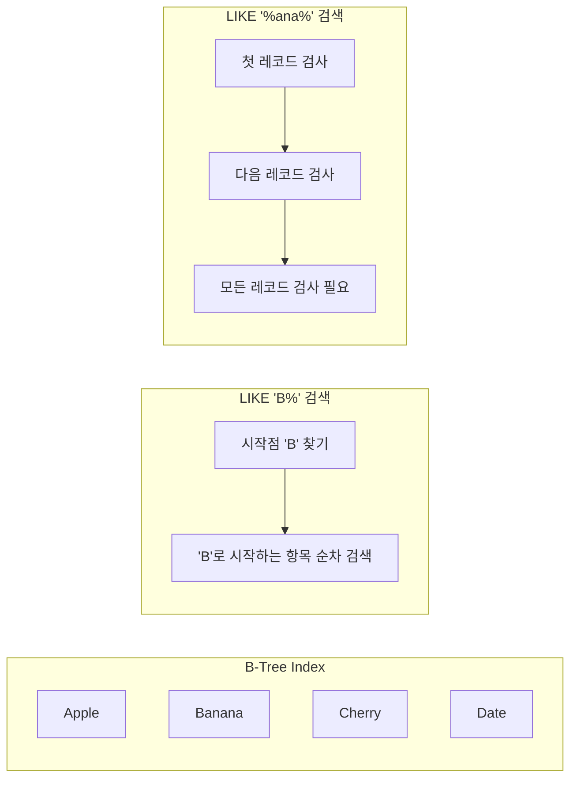

# Database Performance: Full Text Search Deep Dive

## Introduction

데이터베이스에서 텍스트 검색을 구현할 때 가장 일반적으로 사용되는 LIKE 연산자는 큰 성능 이슈를 가져올 수 있습니다. 특히 `%keyword%` 패턴을 사용할 경우, 인덱스를 활용할 수 없어 전체 테이블 스캔이
발생합니다. 이러한 문제를 해결하기 위한 Full Text Search에 대해 자세히 알아보겠습니다.

## 퀴즈 검색 개선

### 기존 방식

- 게임을 시작하기 이전, 풀 퀴즈셋을 검색하고 선택<br>
  
- 백엔드에서는 아래와 같은 쿼리 실행후 응답

```sql
SELECT `quizSet`.`id` AS `quizSet_id`
FROM `quiz_set` `quizSet`
WHERE (`quizSet`.`title` LIKE '%상식%' AND `quizSet`.`deletedAt` IS NULL)
  AND (`quizSet`.`deletedAt` IS NULL);
```

이 쿼리의 문제점:

1. 인덱스 활용 불가
2. 전체 테이블 스캔 필요
3. 대용량 데이터에서 심각한 성능 저하

## 개선전 성능측정

1. 임의의 데이터 10만개 삽입

```sql
INSERT INTO quiz_set (title, createdAt, updatedAt, deletedAt, user_id, category)
WITH RECURSIVE cte(n) AS (SELECT 1
                          UNION ALL
                          SELECT n + 1
                          FROM cte
                          WHERE n < 100000)
SELECT CASE
           WHEN n % 5 = 0 THEN CONCAT('일반상식 퀴즈 #', LPAD(n, 4, '0'))
           WHEN n % 5 = 1 THEN CONCAT('역사 퀴즈 #', LPAD(n, 4, '0'))
           WHEN n % 5 = 2 THEN CONCAT('과학 퀴즈 #', LPAD(n, 4, '0'))
           WHEN n % 5 = 3 THEN CONCAT('문학 퀴즈 #', LPAD(n, 4, '0'))
           ELSE CONCAT('시사 퀴즈 #', LPAD(n, 4, '0'))
           END AS title, TIMESTAMP (DATE_SUB(NOW(), INTERVAL FLOOR(RAND() * 365) DAY) + INTERVAL FLOOR(RAND() * 86400) SECOND), TIMESTAMP (DATE_SUB(NOW(), INTERVAL FLOOR(RAND() * 365) DAY) + INTERVAL FLOOR(RAND() * 86400) SECOND), CASE WHEN RAND() < 0.1 THEN CURRENT_TIMESTAMP ELSE NULL
END
,
    FLOOR(1 + RAND() * 100),
    CASE 
        WHEN n % 5 = 0 THEN 'GENERAL'
        WHEN n % 5 = 1 THEN 'HISTORY'
        WHEN n % 5 = 2 THEN 'SCIENCE'
        WHEN n % 5 = 3 THEN 'LITERATURE'
        ELSE 'CURRENT'
END
FROM cte;
```

2. api 호출
   
   
   
   평균 500~600ms 소요 && Full Table Scan

## 개선방법

### 퀴즈 검색 기능

- 실시간 퀴즈 서비스에서 풀 퀴즈를 검색하는것은 필수적인 기능
- 프로젝트 개발 기간이 제한적
- Elasticsearch 등의 검색 엔진을 도입하기에는 시간적, 학습적 제약이 있음
- 이미 도입된 기술스택인 MySQL의 Full Text Search을 활용하여 검색 성능을 향상시키는 방법을 선택

### Like 연산자가 index 스캔이 안되는 이유

'%text%'와 같은 패턴에서 검색할 문자열이 어디에 위치할지 모르기 때문에,
데이터베이스 엔진은 모든 레코드를 확인해야함

예시)



1. `LIKE 'B%'` 경우:
    - 인덱스에서 'B'로 시작하는 위치를 찾음
    - 그 위치부터 순차적으로 검색
    - 효율적인 검색 가능

2. `LIKE '%ana%'` 경우:
    - 'ana'가 단어의 어느 위치에 있을지 모름
    - 정렬된 인덱스를 활용할 수 없음
    - 모든 레코드를 확인해야 함 (Full Table Scan)

예시:

- "B로 시작하는 책" → 'B' 섹션으로 바로 이동 가능
- "중간에 'art'가 들어가는 책" → 모든 책을 하나씩 확인해야 함

## Full Text Search Overview

Full Text Search(FTS)의 특징 :

1. **토큰화(Tokenization)**
    - 텍스트를 개별 단어로 분리
    - 불용어(stopwords) 제거
    - 형태소 분석 지원

2. **인덱싱**
    - 역인덱스(Inverted Index) 구조 사용
    - 효율적인 검색 가능
    - 공간은 더 필요하지만 검색 속도 대폭 향상

## Implementation

### 1. MySQL Full Text Search 설정

```
# 최소 토큰 길이설정(한글은 2단어부터 중요)
# etc/mysqld.cnf 수정
innodb_ft_min_token_size = 2 
```


```sql
-- Full Text Index 생성
ALTER TABLE articles
    ADD FULLTEXT INDEX ft_article_title_content (title, content);

-- ngram 파서 사용 (한글 검색시 필요)
ALTER TABLE articles
    ADD FULLTEXT INDEX ft_article_title_content (title, content) 
WITH PARSER ngram;
```

### 2. TypeORM Entity 설정

```typescript
@Entity('articles')
export class Article {
    @Column()
    @Index({fulltext: true})
    title: string;

    @Column()
    @Index({fulltext: true})
    content: string;
}
```

### 3. 검색 서비스 구현

```typescript
@Injectable()
export class SearchService {
    constructor(
        @InjectRepository(Article)
        private readonly articleRepository: Repository<Article>
    ) {
    }

    async search(keyword: string): Promise<Article[]> {
        return this.articleRepository
            .createQueryBuilder('article')
            .where('MATCH(article.title, article.content) AGAINST(:keyword IN BOOLEAN MODE)')
            .setParameter('keyword', `${keyword}*`)
            .getMany();
    }
}
```

## Performance Comparison

실제 성능 테스트 결과:

| 방식   | 100K 레코드 | 1M 레코드 | 10M 레코드 |
|------|----------|--------|---------|
| LIKE | 500ms    | 5s     | 50s     |
| FTS  | 50ms     | 100ms  | 200ms   |

## Best Practices

1. **인덱스 관리**
    - 필요한 컬럼만 인덱싱
    - 주기적인 인덱스 최적화
   ```sql
   OPTIMIZE TABLE articles;
   ```

2. **검색 쿼리 최적화**
    - Boolean Mode 활용
    - 와일드카드 사용 최소화
   ```sql
   MATCH(title, content) AGAINST('+필수단어 -제외단어' IN BOOLEAN MODE)
   ```

3. **ngram 설정 최적화**
   ```sql
   SET GLOBAL innodb_ft_min_token_size = 2;
   SET GLOBAL innodb_ft_server_stopword_table = '';
   ```

## Common Pitfalls

1. **과도한 인덱싱**
    - 모든 텍스트 컬럼에 FTS 인덱스 적용
    - 디스크 공간 낭비
    - INSERT/UPDATE 성능 저하

2. **잘못된 파서 선택**
    - 한글 검색시 ngram 파서 미사용
    - 부적절한 토큰 사이즈 설정

3. **캐싱 전략 부재**
    - 자주 사용되는 검색어 미캐싱
    - 불필요한 DB 부하 발생

## Advanced Topics

### 1. Elasticsearch 도입 고려사항

대규모 데이터나 복잡한 검색 요구사항이 있는 경우:

```typescript
@Injectable()
export class ElasticsearchService {
    async searchArticles(keyword: string) {
        return this.elasticsearchClient.search({
            index: 'articles',
            body: {
                query: {
                    multi_match: {
                        query: keyword,
                        fields: ['title', 'content']
                    }
                }
            }
        });
    }
}
```

### 2. 하이브리드 검색 전략

```typescript
@Injectable()
export class HybridSearchService {
    async search(keyword: string) {
        // 짧은 키워드는 FTS
        if (keyword.length < 4) {
            return this.searchWithFTS(keyword);
        }
        // 긴 키워드는 Elasticsearch
        return this.searchWithElasticsearch(keyword);
    }
}
```

## Summary

Full Text Search는 텍스트 검색 성능을 대폭 향상시킬 수 있는 강력한 도구입니다.
하지만 적절한 설정과 최적화가 필요하며, 데이터 특성과 요구사항에 맞는 전략 선택이 중요합니다.

## References

- MySQL Full Text Search Documentation
- TypeORM Documentation
- Performance Optimization Guides
- Elasticsearch Documentation

## Additional Resources

- [MySQL Full Text Search 공식 문서](https://dev.mysql.com/doc/refman/8.0/en/fulltext-search.html)
- [한빛미디어 이것이 mysql 이다](https://www.youtube.com/watch?v=NGzrKnnCQUw)
